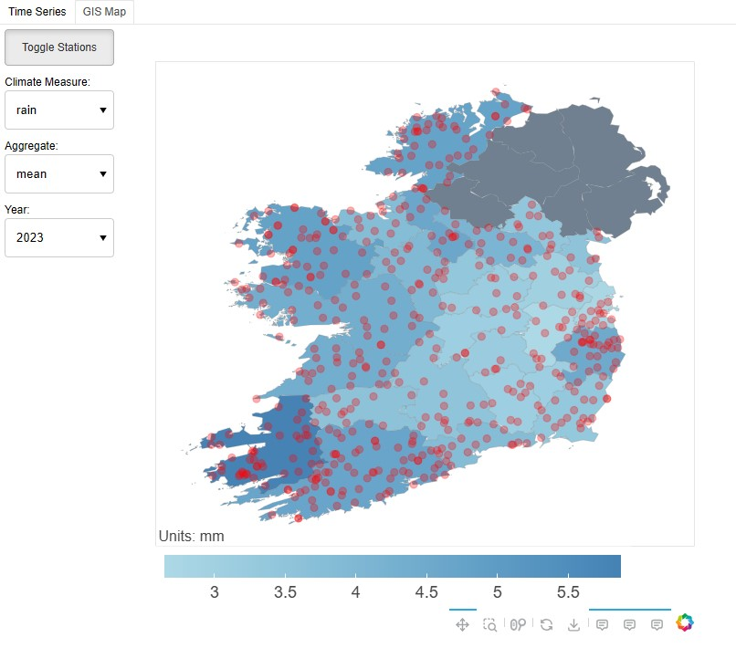

# Irish Climate Dashboard App

## Overview

Dashboard applications are particularly useful for visualising multiple patterns within a dataset in a concise and user friendly way. This repository contains the code and data for running a climate dashboard which visualises meteorological data across Ireland. 

The dashboard application includes two separate interactive Bokeh plots:

1. A time series plot of different aggregated climate measures over time by county
   


2. A gis map of different aggregated climate measures by county



## Data

The underlying meteorological data is sourced from Met Éireann's public historical data portal:
* https://www.met.ie/climate/available-data/historical-data

The different climate measures include:

```
maxtp:  -  Maximum Air Temperature (C)
mintp:  -  Minimum  Air Temperature (C)
gmin:   -  09utc Grass Minimum Temperature (C)
soil:   -  Mean 10cm Soil Temperature (C)
wdsp:   -  Mean Wind Speed (knot)
sun:    -  Sunshine duration (hours)
evap:   -  Evaporation (mm)
rain:   -  Precipitation Amount (mm)
glorad  -  Global Radiation
```

## Running the Application (Windows)

### Anaconda

Create a local conda environment for the Irish Climate Dashboard app using [anaconda](https://www.anaconda.com/):

```
conda create --name irishclimatedashboard python=3.12 --yes
conda activate irishclimatedashboard
pip install -r requirements.txt
```

Start the Irish Climate Dashboard app can then be started using the following command and the local conda environment:

```
bokeh serve dashboard\\bokeh_dash_app.py
```

Once the dashboard app is running, navigate to localhost:5006 in your preferred browser

* http://localhost:5006/bokeh_dash_app

### Docker

The latest version of the Irish Climate Dashboard app can be found as a [docker](https://www.docker.com/) image on dockerhub here:

* https://hub.docker.com/repository/docker/oislen/irishclimatedashboard/general

The image can be pulled from dockerhub using the following command:

```
docker pull oislen/irishclimatedashboard:latest
```

The Irish Climate Dashboard app can then be started using the following command and the docker image:

```
docker run --name icd --publish 5006:5006 --rm oislen/irishclimatedashboard:latest
```

Once the dashboard app is running, navigate to localhost:5006 in your preferred browser

* http://localhost:5006/bokeh_dash_app
