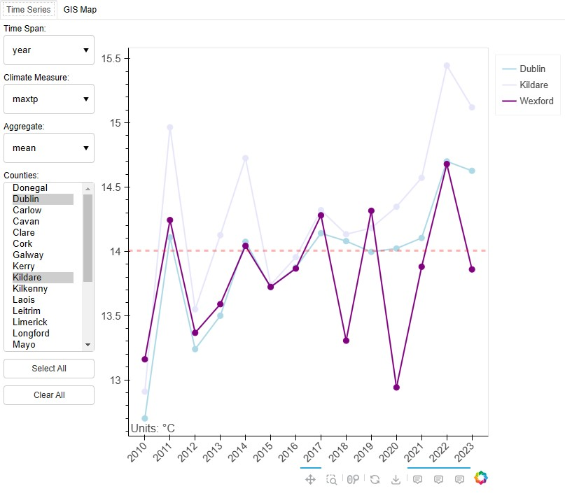

# Irish Climate Dashboard App

## Overview

Dashboard applications are particularly useful for visualising multiple patterns within a dataset in a concise and user friendly way. This repository contains the code and data for running a climate dashboard which visualises meteorological data across Ireland. 

The dashboard application includes two separate interactive plots:

1. A time series plot of different aggregated climate measures over time by county
   

2. A gis map of different aggregated climate measures by county

## Data

The underlying meteorological data is sourced from Met Éireann's public historical data portal:
* https://www.met.ie/climate/available-data/historical-data

The different climate measures include:

    maxtp:  -  Maximum Air Temperature (C)	  "
    mintp:  -  Minimum  Air Temperature (C)	
    gmin:   -  09utc Grass Minimum Temperature (C)	
    soil:   -  Mean 10cm Soil Temperature (C)	
    wdsp:   -  Mean Wind Speed (knot)	
    sun:    -  Sunshine duration (hours)					"	
    evap:   -  Evaporation (mm)	
    rain:   -  Precipitation Amount (mm)	

## Docker Image

The dashboard application is available as a docker image, and is accessible on dockerhub:
* https://hub.docker.com/repository/docker/oislen/irishclimatedashboard/general

## Hosted Dashboard

Hosted dashboards are available on :
